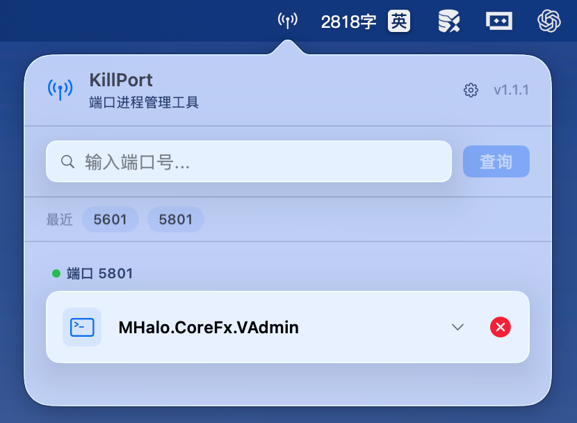
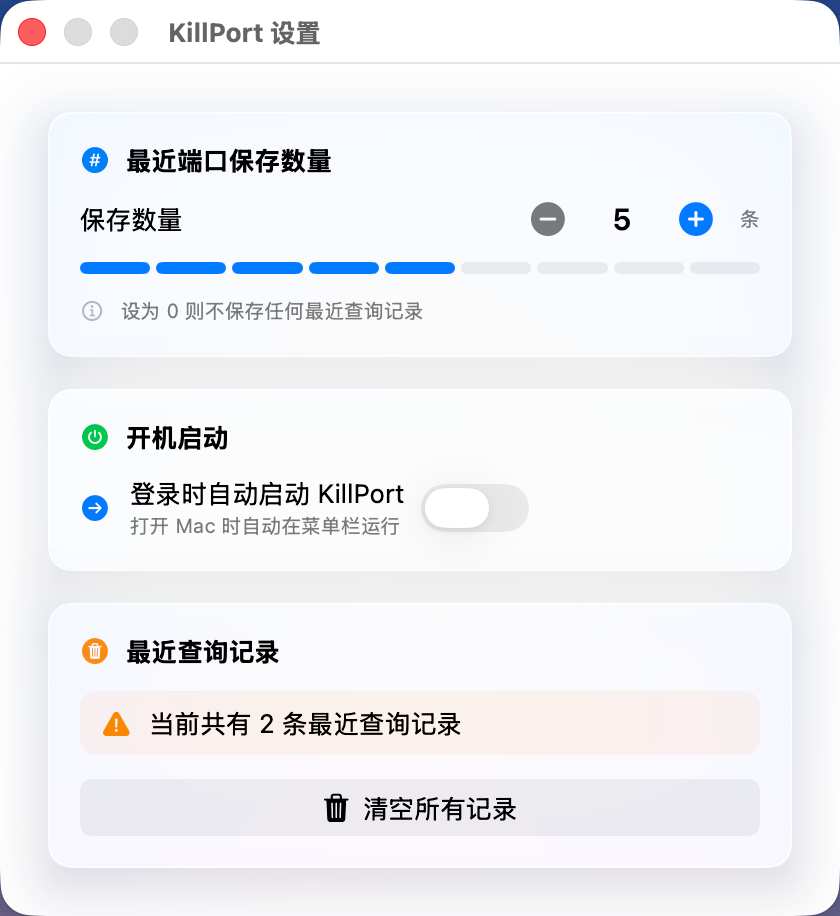

# KillPort

一款 macOS 菜单栏小工具，用于查找并结束占用指定网络端口的进程。

[English README](./README.md)

## 功能特性

- **常驻菜单栏** — 始终显示在系统菜单栏，一键呼出。
- **端口查询** — 输入端口号（1–65535），立即查看占用该端口的进程。
- **进程详情** — 显示命令名、PID、用户、文件描述符、协议类型和连接状态。
- **一键结束** — 在面板中直接终止进程，依次尝试优雅结束（SIGTERM）和强制结束（SIGKILL）。
- **权限提升** — 需要管理员权限时自动弹窗请求授权。
- **自动刷新** — 结束进程后自动刷新结果列表。
- **纯菜单栏应用** — 没有 Dock 图标和主窗口（LSUIElement）。
- **深色模式** — 自动跟随系统浅色/深色外观。
- **现代 UI** — 卡片式结果、毛玻璃效果、流畅动画。
- **最近端口** — 点击标签即可快速重新查询常用端口。
- **设置面板** — 自定义最近端口保存数量、开机自启等选项。

## 截图

### 主界面

输入端口，一览所有占用该端口的进程。



### 设置面板

调整最近端口保存数量、管理开机自启选项。



## 系统要求

- macOS 12.0 (Monterey) 或更高版本
- Swift 命令行工具（无需安装完整 Xcode）

## 构建

### 使用构建脚本

```bash
./Scripts/build.sh
```

脚本会执行以下步骤：
1. 使用 `swift build -c release` 以 Release 模式编译 Swift 包。
2. 在项目根目录生成 `KillPort.app` 应用包。
3. 对应用包进行临时签名。

### 手动构建

```bash
swift build -c release
```

然后手动创建 `.app` 包结构：

```
KillPort.app/
└── Contents/
    ├── MacOS/
    │   └── KillPort          # 编译后的二进制文件
    └── Resources/
        └── Info.plist         # 应用配置
```

## 使用说明

1. 启动 `KillPort.app`。
2. 点击菜单栏中的天线图标。
3. 在输入框中输入端口号（例如 `3000`、`8080`、`5173`）。
4. 点击 **查询** 按钮或按回车键。
5. 查看占用该端口的所有进程。
6. 点击进程卡片右侧的红色 ✕ 按钮终止进程。
7. 在确认对话框中确认操作。

**右键**菜单栏图标可以打开上下文菜单（关于 / 退出）。

### 最近端口标签

- 查询过的端口会自动出现在 **最近** 标签栏中。
- 点击某个标签，下方会高亮显示该端口并仅展示其进程。
- 再次点击同一个标签，取消高亮，返回展示所有最近端口的结果。
- 悬停标签时会出现删除按钮，点击可将该端口从最近列表中移除。

## 工作原理

### 端口扫描

使用系统自带的 `lsof` 工具：

```bash
lsof -i :<port> -P -n
```

`-P` 参数禁止端口到名称的转换，`-n` 参数禁止 IP 到主机名的解析，从而确保输出快速且可预测。

### 进程终止

遵循从优雅到强制的终止策略：

1. **SIGTERM** — 发送 `kill <PID>` 进行优雅结束。
2. **SIGKILL** — 如果 1 秒后进程仍然存在，则发送 `kill -9 <PID>` 强制结束。
3. **管理员权限** — 如果前两种方式都失败（权限不足），使用 `osascript` 弹窗请求用户密码并重新尝试。

## 项目结构

```
MacOS-KillPort/
├── Package.swift                     # SPM 包定义
├── Sources/
│   └── KillPort/
│       ├── KillPortApp.swift         # @main 入口、AppDelegate、NSApplication 初始化
│       ├── StatusBarController.swift  # 状态栏图标 + NSPopover 管理
│       ├── PortScanner.swift         # lsof 封装、端口查询逻辑
│       ├── ProcessKiller.swift       # 进程终止逻辑（SIGTERM → SIGKILL → 提权）
│       ├── ContentView.swift         # SwiftUI 主视图（搜索、结果、卡片）
│       ├── SettingsView.swift        # 设置面板视图
│       ├── SettingsStore.swift       # 设置持久化（UserDefaults）
│       └── Models.swift              # 数据模型（PortProcess、KillResult、ScanState）
├── Resources/
│   └── Info.plist                    # 应用配置（LSUIElement=true）
├── Scripts/
│   └── build.sh                      # 构建 + 打包脚本
├── screenshots/                       # 应用截图
├── .gitignore
├── README.md
└── README_CN.md
```

## 许可

本项目仅供个人使用。
